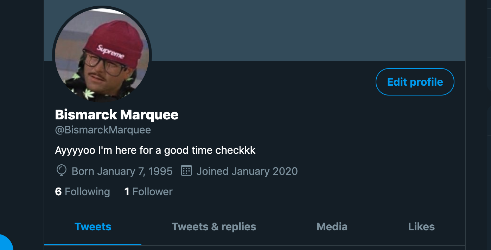
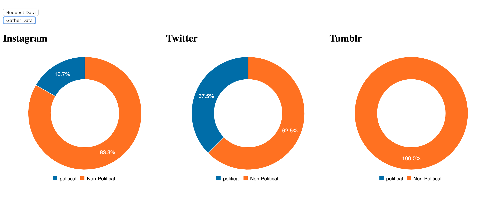

# Bismarck

## Bismarck is a full-stack application

### Concept

Bismarck is an application that grants unique and tailored insights into individuals based on their social media posts.
The Application pulls data from a users posts acccross three seperate web applicaion API's, namely Instagram, Twitter, and Tumblr.

Given the complex nature of privacy issues with web applications of significant and wide scope the application does not gather analytics on a real person but rather a hypothetical 20-something indvidual named Bismarck Marquee. In that sense this application is only an exercise from a proof of concept standpoint. Bismarck(the person) is a fairly prolific social media user and uses the three web apps that Bismarck(the app) pulls data from.

Once the data is collected from each individual API it is persisted on three seperate mongo collections for each individual API.

One the data is gathered it may be run through a keyword filter, based on a users preferences, and renders relevant insights into the nature of the user's posts based on keyword matches. In the demo below we run political keywords through Bismarck Marquee's posts to see on which platforms, if any, he references political keywords and thus a simple, but tailored, insight into his posts.

### Below are Bismarck Marquee social media profiles

### Bismarck in use

This is Bismarck(App) before running data collection

This is Bismarck after running data collection and analysis

### Post Analysis and Charts

From this we can gather that Bismarck is somewhat but not heavily political on his Instagram posts; on Twitter his posts are significantly more political in nature while there is no political content to speak of on his Tumblr posts.
